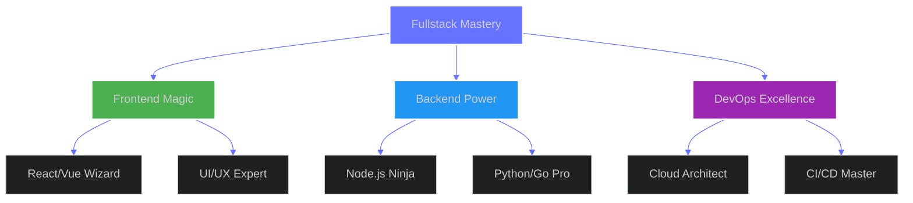

<div align="center">
  
</div>

<div align="center">
  <a href="https://git.io/typing-svg">
    
  </a>
</div>

<div align="center">
  
</div>

## 🌟 Tech Expertise

<div align="center">



</div>

## 🚀 Journey Stats

<div align="center">
  <table>
    <tr>
      <td>
        
      </td>
      <td>
        
      </td>
    </tr>
  </table>
</div>

## 💫 Skills Matrix

```typescript
const expertise = {
  frontend: {
    frameworks: ['⚛️ React', '💚 Vue.js', '⏭️ Next.js', '💠 Nuxt.js'],
    styling: ['🎨 Tailwind', '💅 Styled Components', '📐 SASS'],
    tools: ['📱 Responsive Design', '🔍 SEO Optimization', '🎭 Animations']
  },
  backend: {
    core: ['🟢 Node.js', '🐍 Python', '🔵 Go'],
    frameworks: ['🛡️ NestJS', '⚡ FastAPI', '🚂 Express'],
    databases: ['🐘 PostgreSQL', '🍃 MongoDB', '🔴 Redis']
  },
  devOps: {
    cloud: ['☁️ AWS', '🌐 GCP', '📦 Azure'],
    tools: ['🐳 Docker', '⛵ Kubernetes', '🔄 CI/CD'],
    monitoring: ['📊 Grafana', '🔍 ELK Stack', '📈 Prometheus']
  }
} as const;
```

## 🏆 Achievements

<div align="center">
  
</div>

<div align="center">
  
</div>

## 🌐 Featured Projects

<div align="center">
  <a href="https://github.com/RaulAltamirano/project1">
    
  </a>
  <a href="https://github.com/RaulAltamirano/project2">
    
  </a>
</div>

## 🤝 Connect With Me

<div align="center">
  <a href="https://www.linkedin.com/in/raúl-altamirano-lozano-954281247/">
    
  </a>
  <a href="mailto:altamirano.developer@gmail.com">
    
  </a>
  <a href="YOUR_PORTFOLIO_LINK">
    
  </a>
</div>
