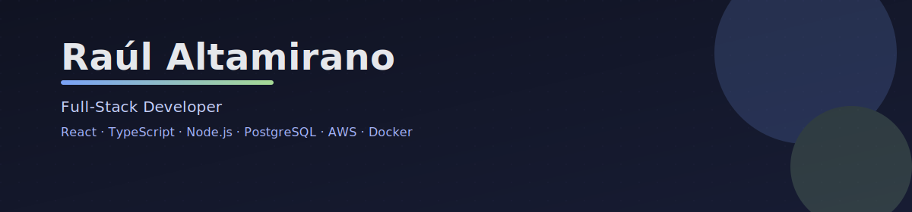
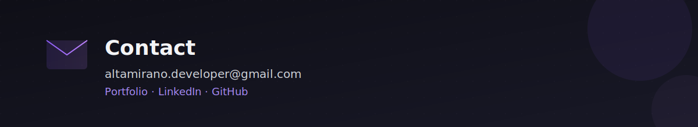

  

## About me

I'm a **full-stack developer** who ships end-to-end web products: interfaces with **React**, **Next.js**, **Vue**, **Nuxt**, and **TypeScript**; services with **Node.js**, **Python**, and **Go**; data on **PostgreSQL**, **MongoDB**, and **Redis**; and delivery on **AWS** with **Docker**, **Kubernetes**, and **GitHub Actions**.

I prioritize clear structure, maintainable code, and straightforward collaboration. **Working languages:** English and Spanish.

---

## Tech stack

**Frontend**

**Backend**

**Databases & cloud**

**DevOps & tools**

---

## Featured projects

| Project | Description |
|--------|-------------|
| [**my-portfolio**](https://github.com/RaulAltamirano/my-portfolio) | Personal portfolio and showcase — front end, projects, and contact. |

*Pin your best repositories on your GitHub profile so visitors see them next to this README.*

---

## GitHub overview

  
  

---

## Practice & problem solving

  

  

---

## Contact

  

  
  
  

Interested in collaborating or hiring? Reach out by email or LinkedIn — I usually reply within a few days.

