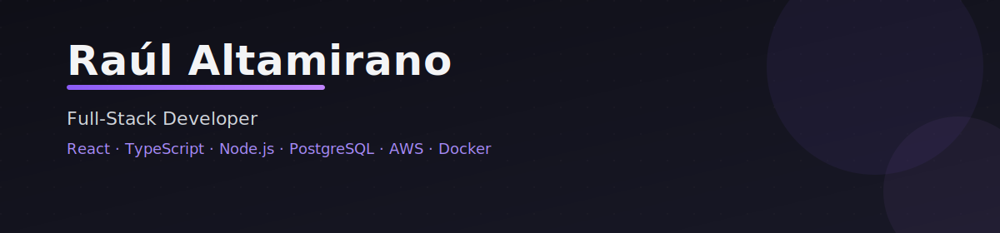

  

## 🛠 Tech Stack  

**Frontend**  
`React` `Next.js` `Vue.js` `Nuxt.js` `TypeScript`  

**Backend**  
`Node.js` `Python` `Go`  

**Databases & Cloud**  
`PostgreSQL` `MongoDB` `Redis` `AWS`  

**DevOps & Tools**  
`Docker` `Kubernetes` `GitHub Actions`  

---

## 📊 GitHub Overview  

  
  

---

## 🔗 Profiles  

  

---

## 📫 Contact  

